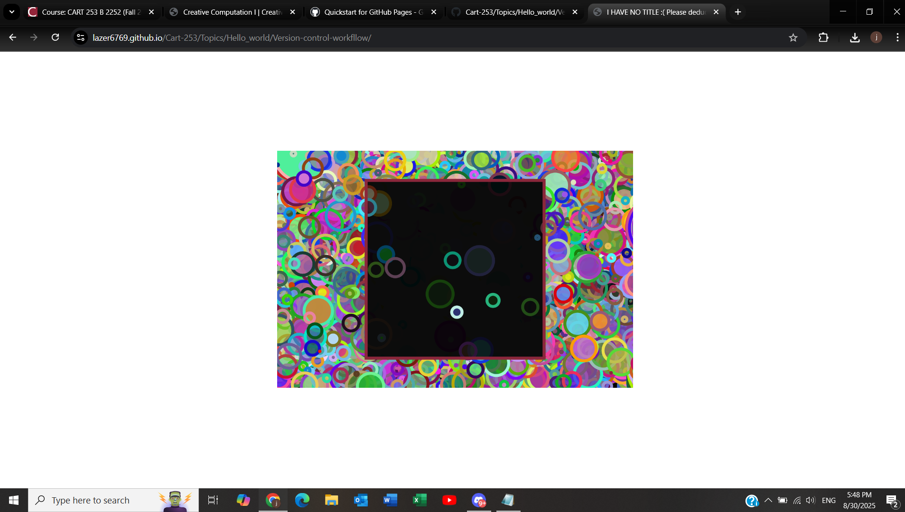

# New Year New "code"

Lazer6769

[View this project online](https://editor.p5js.org/Lazer34/full/fGi92OcyL)

## Description

This description should help the reader understand what the program is, anything they should know to be able to experience it (controls, special features, etc.), and what the desired user experience is. For example:

> **New Year New "code"** 
>> * contains some code that I made during my college semester.*

> The controls for this project are moving the mouse. Once you move the mouse, you will be able to control the brightly coloured circle 

> move your brightly coloured circle from the black background towards black square having your trail fade away once it enters and fade back in once it exits 

## Screenshot(s)

This bit should have some images of the program running so that the reader has a sense of what it looks like. For example:

> 
> 

## Attribution

This bit should attribute any code, assets or other elements used taken from other sources. For example:

> - This project uses [p5.js](https://p5js.org).

## License

This bit should include the license you want to apply to your work. For example:

> This project is licensed under a Creative Commons Attribution ([CC BY 4.0](https://creativecommons.org/licenses/by/4.0/deed.en)) license with the exception of libraries and other components with their own licenses.
