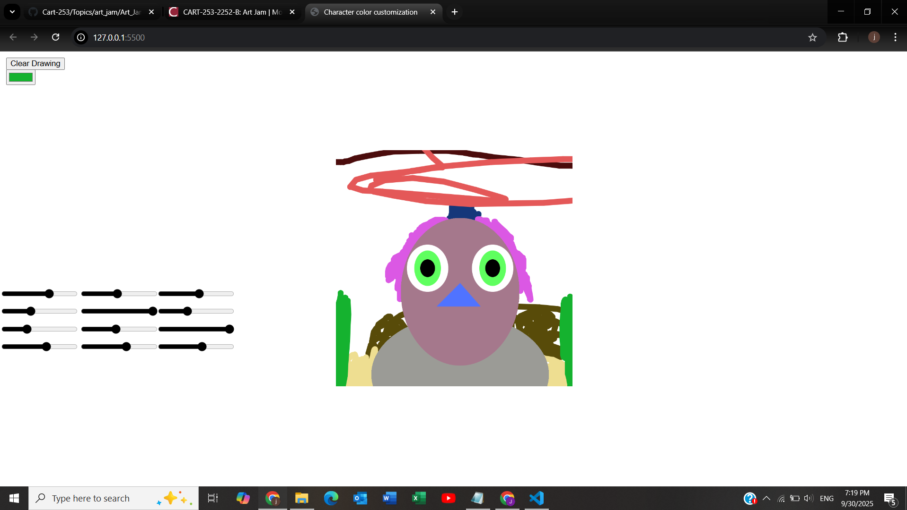

# Character color customization

Jordan Lobasso

[View this project online](https://lazer6769.github.io/Cart-253/Topics/art_jam/Art_Jam_Final/)

## Description

> This program allows you to change the colors of the character you, 

> you can change the skin, irises, nose, and body color of the subject with the sliders

> as well as having the ability to draw anywhere on the screen except for on the character itself
> and you can even clear the drawings to restart it 

> and you can PICK COLORS

Also, for code I had never used before, I had never used both the color picker and the clear drawing features. First time using those  

## Screenshot(s)

This screenshot is just showing what you can do with the colors and the drawing function:

> 

## Attribution

This bit should attribute any code, assets or other elements used taken from other sources. For example:

> - This project uses [p5.js](https://p5js.org).
> - color picker [p5.js(https://p5js.org/reference/p5/createColorPicker/)
> - sliders with color [p5.js](https://editor.p5js.org/yellowsubmarine/sketches/7jKeK8CGW)
> - clear button https://p5js.org/reference/p5/clear/
> - the ability to draw [p5.js]
    (https://p5js.org/examplesanimation-and-variables-drawing-lines/)

]

## License

This bit should include the license you want to apply to your work. For example:

> This project is licensed under a Creative Commons Attribution ([CC BY 4.0](https://creativecommons.org/licenses/by/4.0/deed.en)) license with the exception of libraries and other components with their own licenses.
